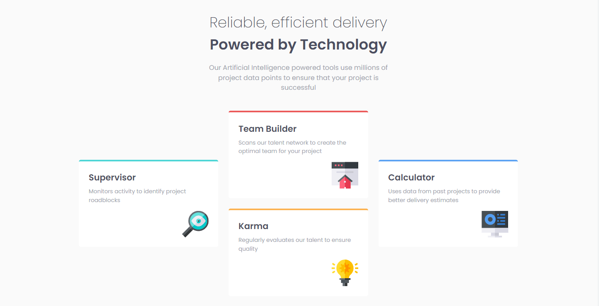
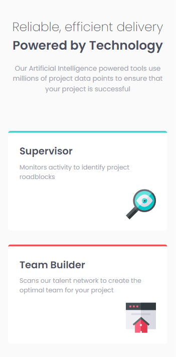
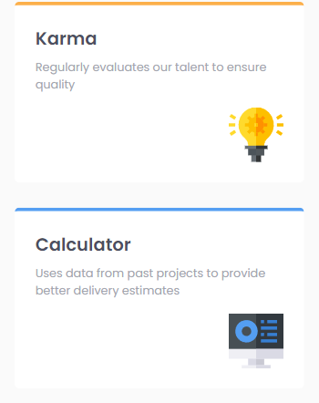

# Frontend Mentor - Four card feature section solution

This is my personal solution to the [Four card feature section challenge on Frontend Mentor](https://www.frontendmentor.io/challenges/four-card-feature-section-weK1eFYK). Frontend Mentor challenges help you improve your coding skills by building realistic projects. 

## Heres are a few features of my website / component

* The HTML uses semantic tags where possible.
* Mobile first design as to be inline with Googles mobile first indexing best practices in relation to SEO.
* The page is made responsive, by using a CSS GRID layout for the Main Layout, while the elements contained within the cards use a flex layout. 
* The page currently has 3 breakpoints but more could be added in the future.
* Rems are used as the prefered unit of measure. 
* CSS variables added for colors that are re-used on multiple elements, this way the color scheme can be changed easily.
* Implement BEM naming conventions where appropriate

## Table of contents

  - [Screenshot](#screenshot)
  - [Links](#links)
  - [Built with](#built-with)
  - [Author](#author)

### Screenshot
##### Desktop View - Below (1440px viewport width)

##### Mobile View - Below (375px viewport width)

### Links

- Solution URL: [https://github.com/jacksen30/Four-Card-Feature-Section]
- Live Site URL: [https://four-card-component-challenge-fe.netlify.app/]

### Built with

- Semantic HTML5 markup
- CSS 3
- CSS GRID layout
- CSS FLEX layout for contents of the card elements
- BEM naming conventions

## Author

- Website - [Jacksen Nillson](https://devbyjacksen.com/)
- Frontend Mentor - [@jacksen30](https://www.frontendmentor.io/profile/jacksen30)